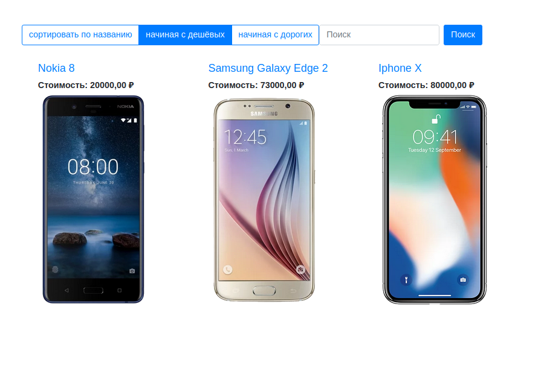

# Phones Showcase

This project represents a Django-based draft for an online Phone Catalogue. It allows users to browse through a list of different phones and see details about each of them. One of the main features of this web application is the ability to perform various searches and sorts. The outlook of the pages is set up via Django templates using a bootstrap.

### Key Features
The application includes a Django command for importing data from a CSV file. The command (import_phones.py) reads the phone data and adds new phone entries to the database. This is a versatile feature that supports easy database seeding and updating.

The Phone model represents a single phone with details such as name, price, image, release date, and LTE availability. The slug field serves as a unique identifier for each phone and is automatically created based on the name of the phone. This ensures each phone can be easily accessed using a human-readable URL.

The application provides a search functionality on the name of the phones. Users can use the search bar to find phones by typing partial or complete names.
The catalogue page provides options for sorting the phones. The user can sort by name, min_price or max_price.

